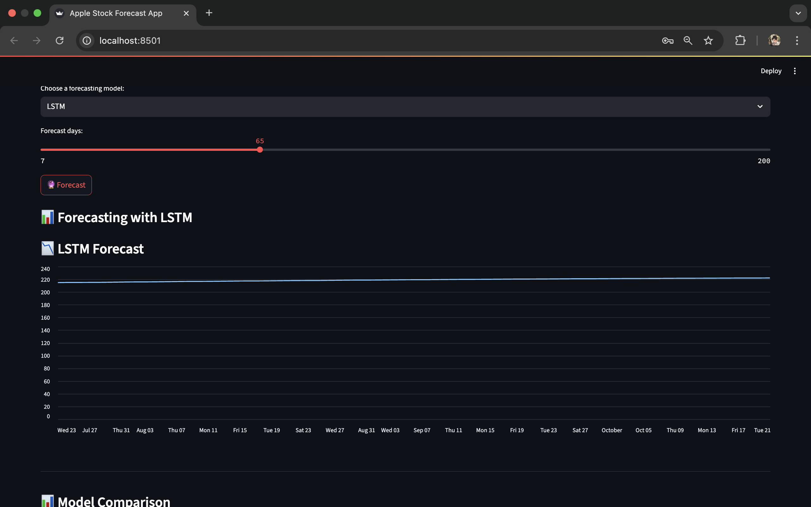

# Apple-Stock-Price-Forecasting-Web-App

This project focuses on forecasting Apple (AAPL) stock prices using various time series forecasting models. The web app is built using Streamlit to provide an interactive, user-friendly interface for exploring model predictions and it also provide the option to choose model to predict. This helps in identifying trends and making informed investment decisions.

## Models Used

We implemented and compared the performance of the following models:

1. ARIMA (AutoRegressive Integrated Moving Average)
2. SARIMA (Seasonal ARIMA)
3. Prophet (by Facebook/Meta)
4. LSTM (Long Short-Term Memory)

After evaluating all models, LSTM provided the most accurate forecasting results** due to its ability to learn complex patterns and temporal dependencies in the data.

## Tech Stack

- Python
- Pandas, NumPy, Matplotlib, Seaborn – Data processing & visualization
- Statsmodels – ARIMA, SARIMA models
- Facebook Prophet
- TensorFlow/Keras – LSTM model
- Streamlit – Web app deployment

